# Introducción

1. La práctica industrial moderna requiere, para múltiples usos:
* la compresión de gases y vapores
* el accionamiento de herramientas neumáticas y mecanismos de potencia
* el enfriamiento intenso y concentrado
* la limpieza,
son aplicaciones corrientes que demandan aire comprimido. 

2. Otros gases deben ser comprimidos para:
* usos médicos $O_2$, $N_2$
* extinción de incendios $CO_2$ y otros,
* soldadura, $O_2$, argón, acetileno, butano, etc.,
* domésticos (G.L.P)

3. Los equipos de refrigeración requieren la compresión de vapores.

## Clasificación 1

Un compresor es una máquina que entrega energía a un fluido compresible, para elevar su presión. No obstante, hay denominaciones especiales de acuerdo al aumento de presión que logran.

$$
r_c=\frac{p_{desc}}{p_{adm}}
$$

Cuando las elevaciones de presión son reducidas por ejemplo, si se cumple **$r_c < 1,1$**, las
máquinas utilizadas son llamadas **ventiladores**. En esos casos, la densidad del gas suele no
variar más de de un 5%, por lo que en ese proceso el fluido puede ser supuesto
incompresible.

Cuando **$1,5 < r_c < 2$**, es frecuente llamarlas **sopladores o soplantes**.

Para relaciones mayores, se llaman **compresores**.

## Clasificación 2

Se distinguen dos clases principales de compresores: 
1. volumétricos o de desplazamiento positivo
2. dinámicos o turbocompresores.

### Compresores volumétricos.

El funcionamiento de los compresores volumétricos, también llamados "de desplazamiento
positivo", puede esquematizarse así:
1. El fluido entra a una cámara o recinto cerrado ("cámara de compresión") donde
queda confinado.
2. Mediante la entrega de trabajo desde el exterior se reduce el volumen de la
cámara, por movimiento o deformación de una o más paredes de ésta.
3. El gas con volumen específico reducido, y por lo tanto con mayor presión, es
evacuado o comunicado con las instalaciones donde será usado.

Se distinguen dos grandes tipos de compresores volumétricos, según el tipo de movimiento del órgano que trasmite energía al fluido: 
* los reciprocantes (de pistón o de diafragma)
* los rotativos (de tornillo, paletas deslizantes, etc)
  

> **En los compresores volumétricos el caudal de gas comprimido es sensiblemente independiente de la presión a la cual descargan**

### Compresores dinámicos.
> **En los llamados compresores centrífugos o turbo compresores al variar la presión de descarga varía (en sentido inverso) el caudal.** 

Estos compresores, de construcción similar a las bombas centrífugas o máquinas axiales, son de aplicación industrial mucho menos extendida en nuestro país. Se utilizan para relaciones de compresión por cada etapa **no muy altas** y **caudales muy grandes**

Cuando se requiere trabajar a caudales y cargas relativamente elevados, ello se logra con grandes dimensiones, varias etapas y/o con altas velocidades de rotación, lo que hace que estas máquinas requieran muy alta precisión en su construcción y montaje.

\newpage
# Un poco de termodinámica para "los de producción"

## Presión

Sea una superficie S sobre la cual se ejerce una fuerza **distribuida** F normal a S, y sea A el área sobre la cual se aplica dicha fuerza se llama **presión** a:
$$
p = \frac{F}{A}
$$

### Unidades
Es usual medir la presión en $kg/cm^2$ ó en atmósferas técnicas, (at), o en $lb/in^2$ (psi).

La unidad de presión en el Sistema Internacional es el Pascal (Pa). Se cumple:

$$
1Pa = 1N/m^2 = 1,0197 \times 10^{-5} Kg_f/cm^2 = 1,45054 \times 10^{-4} psi
$$

También se usa como unidad práctica el bar $1 bar = 10^5 Pa$ .

Se llama "atmósfera barométrica" o "atmósfera absoluta" (atm) a la presión que produce
una columna de 760 mm de mercurio cuya densidad sea de 13595,1 $kg/cm^3$ , a nivel del
mar y a 0ºC.

De la definición de atmósfera absoluta se deduce que:
$$
1 atm = 760 mm Hg (a 0ºC) = 1,0332 atm = 101332 Pa \approx 1,01 \times 10^5 Pa
$$

Llamando $p_at$ a la presión atmosférica en el lugar de medición, un manómetro indica la "sobrepresión" o "presión manométrica":
$$
p_m = p - p_{at}
$$
siendo p la presión absoluta.

Cuando se deba indicar que la presión considerada es absoluta, su magnitud se indicará en "bara", "psia" o "Pa (abs.)".

## Gas Ideal

Un gas ideal se considera constituido por moléculas entre las que no existe la atracción u otra forma de interacción (salvo el choque elástico), y el volumen de las cuales es despreciable comparado con el espacio intermolecular.

$$
P \cdot v = \frac{R \cdot T}{PM}
$$

si P en Pa, $v$ en $m^3/kg$, T en K y **PM en kg/mol** entonces $R=8,314$ con las unidades correspondientes

### Peso Molecular PM

El **peso** molecular es la **MASA** que posee **un mol** de un elemento dado.

¿Y qué es un mol?, se preguntan "los de producción", con razón.  
Es simplemente una manera abreviada de decir $6,02 \times 10^{23}$ de algo.
Por ejemplo un mol de sillas, serían $6,02 \times 10^{23}$ sillas

¿Y por qué se usa tanto en química?, por que nosotros conocemos la cantidad de protones y neutrones que 
tienen los núcleos de los átomos de los elementos conocidos (por ejemplo, en el $C_{12}$ hay 6 y 6 y quisieron 
la casualidad... y un tal Avogadro que la masa contenida en $6,02 \times 10^{23}$ átomos de $C_{12}$ sea 
aproximadamente 12 g/mol)

\newpage
# COMPRESORES RECIPROCANTES

## Ciclo de compresión ideal

Una vez capturado el gas en el interior del compresor, ocurre una evolución cíclica que consta de las 
siguientes etapas (ver el diagrama p-v en la Fig. 3.1):

- 4-1: aspiración o captura de gas, a la presión p1 de entrada
- 1-2: compresión de dicho gas, debido a la reducción del volumen del gas capturado
- 2-3: expulsión o escape del gas comprimido, a la presión p2 de descarga
- 3-4: caída brusca de la presión (al no quedar gas y retomar la cámara de compresión su volumen original)
- Inmediatamente después de 3-4 se permite nuevamente la admisión y recomienza el ciclo

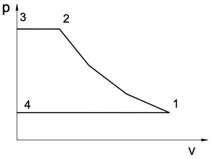

Obsérvese que 1-2 es un proceso termodinámico, en el sentido de que en él evoluciona una masa fija de gas. 
En cambio en las etapas 2-3 y 4-1 varía la masa encerrada. Los puntos del segmento 2-3 no representan 
el estado del gas pues éste, si bien evacúa a presión $p_2$, lo hace con un volumen específico $v_2$. 
Por esto, 1-2-3-4 no es un ciclo en sentido termodinámico, aunque es costumbre usar esa palabra.

Llamando V al volumen de la cámara de compresión en cada momento y p a la presión en su interior, 
el diagrama p-V sería análogo al anterior (se trata de un cambio de escala en el eje de abscisas). 
El diagrama p-V, entonces, no representaría estados del gas, pero todos sus puntos tendrían la misma 
interpretación.

### Procesos de compresión.

En los compresores volumétricos, se suele aceptar que el proceso 1-2 (Fig. 3.1) es politrópico, o sea, que se cumple:
$$
p \cdot v^k = cte.
$$
para algún valor de k.

Como la compresión se realiza con una masa fija de gas encerrado, durante dicho proceso
se puede sustituir el volumen específico por el volumen ocupado V:
$$
p \cdot V^k = cte.
$$

Si el proceso fuera adiabático, sería
$$
k = \gamma  = \frac{c_p}{c_v}
$$
Pero siempre hay transferencia de calor, natural o forzada. Por lo tanto, el exponente
politrópico k suele tomar valores menores que $\gamma$ sin llegar nunca a ser k=1 (proceso
isotermo).

## Ciclo de compresión teórico

El gas en el interior del cilindro experimenta una evolución cíclica que consta de las etapas
mencionadas antes (ver Fig. 3.1).

Pero en realidad, el pistón en su P.M.S. no está tocando la culata del cilindro, pues:

1. Hay que prever imprecisiones de construcción o desgastes en cojinetes o dilataciones por cambio de temperatura.
2. Se necesita espacio para el movimiento de apertura y cierre de las válvulas.

Entonces, queda un espacio no barrido por el pistón, llamado "espacio nocivo o muerto"; este espacio
queda ocupado por gas a presión p2, que no es expulsado en la etapa 2-3 y que se expande en la etapa 3-4.

El ciclo corregido por ese motivo tendría el diagrama p-v indicado en la figura 4.6.

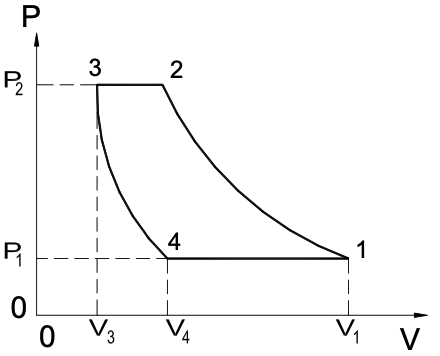

Para compresores de aire con cilindros aletados exteriormente para refrigeración por aire, k suele valer entre 1.25 y 1.38. Si el cilindro tiene camisa refrigerada por agua, k suele valer entre 1.20 y 1.35.

Debido a la diferencia de las condiciones del intercambio térmico y a la falta de hermeticidad en las diferentes fases del ciclo, el exponente politrópico de la compresión puede diferir del de la expansión. No obstante, es usual considerar que el mismo exponente politrópico es válido para la compresión 1-2 y para la expansión 3-4.

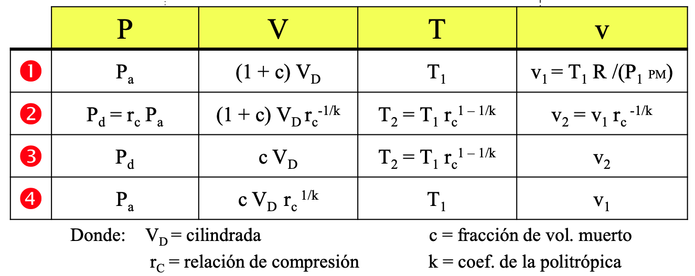

## Factores de disminución del caudal impulsado.
### Espacio muerto

El volumen desplazado por el pistón en una carrera vale:
$$
V_D = V_1 – V_3
$$

El espacio muerto, $V_3$ , es una **característica constructiva** del cilindro (aunque en ocasiones se lo puede variar). Es usual expresarlo como una fracción del volumen desplazado:

$$
V_3 = c \cdot ( V_1 – V_3 )
$$

En los compresores más comunes, c suele tomar valores entre 0.02 y 0.10.
Se llama **"eficiencia volumétrica teórica"** al cociente:
$$
\eta_{vT} = \frac{V_1 - V_4}{V_1 - V_3}
$$

Se llama **"relación de compresión"** al cociente:
$$
r_c = \frac{p_2}{p_1} =  \frac{p_3}{p_4} =  \left(\frac{V_4}{V_3}\right)^k 
$$

La eficiencia volumétrica se puede expresar en términos de c y r:
$$
\eta_{vT} = 1 + c - c \cdot r_c^{1/k}
$$

### Calentamiento en la entrada.

El gas que ingresa al cilindro no se encuentra a la misma temperatura que a la entrada al compresor. En efecto, desde la entrada hasta el cilindro el gas recorre conductos cuyas paredes están a mayor temperatura que él. También experimenta un aumento de temperatura mientras ingresa al cilindro por estar a mayor temperatura las paredes de éste.

Por lo tanto el cilindro succiona, en cada embolada, el volumen calculado pero a temperatura mayor, o sea con densidad menor. 
El volumen de gas extraído en cada ciclo del ambiente del cual toma no es $V_1 – V_4$ sino menor. Refiriéndolo a las condiciones en la entrada del compresor, equivale a un volumen reducido en un factor $f_T < 1$.

Si se puede medir la temperatura $T_i$ al **ingreso al cilindro**, se puede calcular $f_T$ como $f_T = \frac{T_1}{T_i}$ y según muestra la experiencia, este valor anda entre 0,97 y 0,99.

### Pérdidas de carga en la entrada.

Desde la entrada al compresor hasta el cilindro hay pérdidas de carga en filtros, conductos de admisión y válvulas de admisión. 
La presión y por lo tanto la densidad del gas al acceder al cilindro es menor que en la entrada al compresor. 

Refiriéndolo a las condiciones de entrada, equivale a un volumen reducido en un factor $f_{PC} < 1$ .
Si se puede medir la presión $p_i$ a la entrada al cilindro, se puede calcular $f_{PC}$ aplicando como $f_{PC} = \frac{P_1}{P_i}$ y según muestra la experiencia, este valor también anda entre 0,97 y 0,99.

### Fugas.

La masa de gas que egresa del compresor, en cada ciclo, no es igual a la que ingresa debido
a las inevitables fugas:
* falta de estanqueidad de las válvulas.
* falta de estanqueidad de los aros del pistón.
* falta de estanqueidad entre vástago y tapa posterior, en el caso de un pistón de doble efecto.

Se define entonces un tercer factor $f_F$ que toma en cuenta estas perdidas.

Entonces, habiendo considerado todos los factores que hacen disminuir el caudal impulsado, podemos definir una **eficiencia volumértrica real \eta_{vR}** de la siguiente forma:
$$
\eta_{vR} = \eta_{vT} \cdot f_F \cdot f_T \cdot f_{PC}
$$

## Cálculo del caudal y flujo másico.
Siendo L la carrera del pistón y D su diámetro, el volumen desplazado vale:
Compresores 24
$$
V_D = V_1 - V_3 = \frac{\pi \cdot D^2}{4} \cdot L
$$

y el volumen de gas que un cilindro de **simple efecto o acción** toma del recinto o ambiente en cada
ciclo vale:
$$
V_{in} = V_D \cdot \eta_{vR} = V_D \cdot \eta_{vT} \cdot f_F \cdot f_T \cdot f_{PC}
$$

Si el pistón realiza **N** ciclos por unidad de tiempo y el compresor tiene **Z** cilindros iguales
operando en paralelo, el caudal de gas que entrega, medido en las condiciones de entrada,
vale :
$$
Q = V_D \cdot N \cdot Z \cdot j \cdot \eta_{vR}
$$
$$
w = Q \cdot \rho_1
$$

donde **$j=1$** si el pistón es de **simple efecto o acción** y **$j=2$** si es de **doble efecto** (en realidad, para un compresor de doble efecto habría que descontar del volumen desplazado el volumen ocupado por el vástago o la biela, que suele ser relativamente pequeño).

## Trabajo por ciclo
Supóngase que el ciclo del compresor es el de la Fig. 4.6, donde 4 - 1 y 2 - 3 son procesos a presión constante.En abscisas se representa el volumen V de gas encerrado en la cámara de compresión.
Para el proceso de compresión 1-2, el volumen V es proporcional al volumen específico o inversamente proporcional a la densidad:
$$
V = v \cdot M_1 = \frac{M_1}{\rho}
$$
siendo M la masa del gas atrapado en el punto 1.  Análogamente para el proceso 3-4.

Se cumplirá, en el proceso 1-2 :
$$
p \cdot V^k = Cte. = p_1 . V_1^k
$$

y en 3-4

$$
p \cdot V^k = cte. = p_4 . V_4^k
$$

El trabajo realizado por el pistón en un ciclo vale:

$$
W_p = \frac{k}{k-1} \cdot p_1 \cdot (V_1 - V_4) \cdot \left( r_c^{\frac{k-1}{k}} - 1 \right)
$$

El subíndice p recuerda que las etapas de compresión y expansión se supusieron **politrópicas**. 
Si se hubieran supuesto **adiabáticas** $(k = \gamma = c_p / c_v)$, el trabajo $W_a$ en ese ciclo sería:

$$
W_a = \frac{\gamma}{\gamma-1} \cdot p_1 \cdot (V_1 - V_4) \cdot \left( r_c^{\frac{\gamma-1}{\gamma}} - 1 \right)
$$

En cambio si fueran isotermas $(k = 1)$, resultaría :

$$
W_{iso} = p_1 \cdot (V_1 - V_4) \cdot \ln (r_c)
$$

### por unidad de masa

$$
\widehat{W} = \frac{W_{ciclo}}{(\text{masa admitida por ciclo})}
$$

 

$$
\widehat{W} = \frac{W_{ciclo} \cdot R \cdot T_1}{P_1 \cdot (V_1 - V_4) \cdot PM}
$$

## Ciclo real o INDICADO
Se estudiará la influencia que ejercen sobre el diagrama del ciclo las condiciones reales (no ideales):

### retardos en apertura de válvulas.

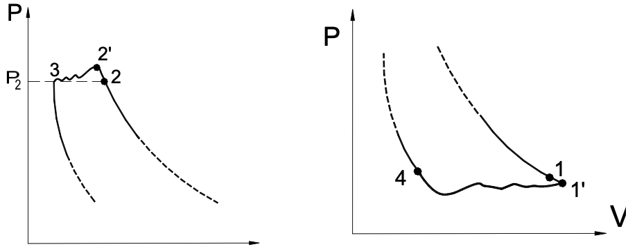

### compresión y expansión no exactamente politrópicas.

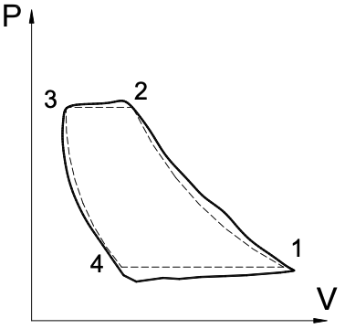

Por estos motivos, el ciclo real del compresor ve modificado su diagrama con respecto al ciclo teórico, quedando con la forma indicada en la Fig. 4.10.

El diagrama de la Fig. 4.10 se llama "diagrama indicado" y el área encerrada representa el **"trabajo indicado"**, **$W_I$** , del cilindro.
Usando instrumental adecuado se puede hallar el diagrama indicado directamente de la operación del compresor.

## Rendimiento politrópico, adiabático e isotérmico.

Por no ser los procesos de compresión y expansión no exactamente politrópicos, el trabajo por ciclo,
así como la potencia requerida, son mayores que las calculadas suponiendo los procesos politrópicos (véase Fig. 4.10)

Se llama **“rendimiento politrópico”** al cociente de los trabajos politrópico e indicado para un ciclo, o de las potencias politrópica e indicada:

$$
\eta_p = \frac{W_p}{W_I} = \frac{\dot{W_p}}{\dot{W_I}}
$$

Análogamente, se define el **“rendimiento adiabático”**: si los procesos 1-2 y 3-4 se hubieran
supuesto adiabáticos, se llegaría a una expresión análoga a, con $k = \gamma = c_p / c_v$. 

En este caso, se define:
$$
\eta_a = \frac{W_a}{W_I} = \frac{\dot{W_a}}{\dot{W_I}}
$$

siendo la relación entre $\eta_p y \eta_a$ la siguiente:

$$
\eta_p = \eta_a \cdot \frac{W_p}{W_a} = \eta_a \cdot \frac{\gamma - 1}{\gamma} \cdot \frac{k}{k - 1} \cdot \frac{r_c^{\frac{k - 1}{k}}-1}{r_c^{\frac{\gamma - 1}{\gamma}}-1}
$$

Análogamente se puede definir el **rendimiento isotermo**:

$$
\eta_{iso} = \frac{W_{iso}}{W_I} = \frac{\dot{W_{iso}}}{\dot{W_I}}
$$

\newpage
##  Fraccionamiento de la compresión.
### Ciclos de alta y baja presión.
Si la relación de compresión r es muy elevada, se generan grandes esfuerzos sobre el pistón, que se trasmiten a la biela, sus pernos y cojinetes, y el cigüeñal.
Por estos motivos, se acostumbra "fraccionar" la compresión (ver Fig. 4.12).

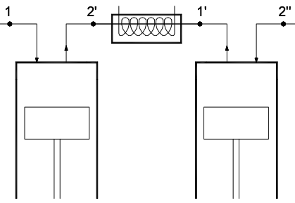

Para ello, se comprime en un primer cilindro ("cilindro de baja") hasta el punto 2' (ver Fig.4.13). Luego se enfría hasta una temperatura igual o muy poco mayor que la del punto 1 (punto 1'). Ese gas a presión p1' ingresa a otro cilindro, donde se comprime hasta llegar a la presión p2 (punto 2"). Escapa el gas, quedando sólo la parte atrapada en el espacio muerto del cilindro de alta (punto 3). Este se expande hasta 4', momento en que comienza a ingresar gas proveniente del cilindro de baja. El escape de éste se realiza hasta que  queda sólo el gas de su espacio nocivo (punto 3'). Este gas se expande hasta 4". O sea, el cilindro de baja opera en el ciclo 1-2'-3'-4", y el de alta en el ciclo 1'-2"-3-4'.

Se produce un ahorro de energía en el ciclo, representado por el área 2'-2-2"-1', al cual hay que descontarle la pequeña área 4-4'-3'-4".

Obsérvese que también aumenta el valor de $\eta_{vT}$ por cada etapa; o sea, se puede lograr que
el caudal no disminuya tanto para el mismo volumen desplazado (es decir, para el mismo
cilindro y carrera).

### Fraccionamiento óptimo de la compresión.
Se calculará la presión $p_2$ a la cual conviene fraccionar la compresión para que sea mínima 
la potencia total requerida. Se realizarán varias hipótesis simplificadoras:
1. En ambas etapas de compresión, el índice politrópico k y el rendimiento politrópico $\eta_p$ son iguales. Además, para cada etapa se supone $\eta_p$ independiente de r.
2. $p_{1’} = p_{2’}$. Se deduce que $r = r_A \cdot r_B$
3. Los puntos 1 y 1' están sobre una misma isotermaLa 

La potencia total **indicada** $\dot{W_{T}} = \dot{W_{A}} + \dot{W_{B}}$ junto con las hipótesis 1 y 2:

$$
\dot{W_{T}} = \frac{k}{k-1} \cdot \frac{p_1 \cdot Q}{\eta_p \cdot \eta_{v_TA} \cdot \eta_{v_TB}} \cdot \left( \left( r_A^{\frac{k-1}{k}} - 1 \right) + \eta_{v_TB} \left( r_B^{\frac{k-1}{k}} - 1 \right) \right)
$$

para que la potencia sea mínima:

$$
r_B = \eta_{v_B}^{\frac{k}{2(k-1)}} \cdot \sqrt{r}
$$

si suponemos $\eta_{v_B} = 1$ nos queda:

$$
r_B = r_A = \sqrt{r} = \sqrt{\frac{p_1}{p_2}}
$$

o también:

$$
p_{1'} = \sqrt{p_1 \cdot p_2}
$$

Esta condición optimiza el consumo (indicado) de potencia en las hipótesis mencionadas.

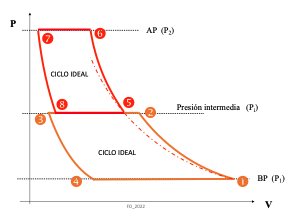

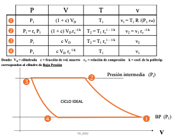

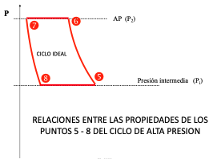

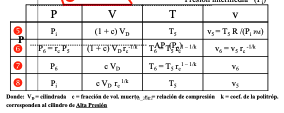

\newpage

# COMPRESORES ROTATORIOS (TORNILLO)
En los compresores reciprocantes o alternativos, su movimiento involucra grandes fuerzas de inercia, con aceleraciones y desaceleraciones violentas en cada carrera.

Los compresores volumétricos rotativos fueron desarrollados para evitar esas fuertes aceleraciones y deceleraciones que, en los reciprocantes, requieren dimensionados muy exigentes para carcasas, bielas, cojinetes, pistones; y que provocan pulsaciones en la descarga del fluido inherentes a su funcionamiento alternativo.

Se caracterizan por tener rotores que, con la carcasa, delimitan volúmenes en los cuales se captura una cierta cantidad de gas y se la conduce hasta la conexión a la descarga.  Debido a ese principio de funcionamiento, suelen no tener válvulas de admisión ni de escape.

A diferencia de los compresores reciprocantes, la compresión no se produce
exclusivamente por reducción de volumen de un recinto cerrado, sino que se trata, genéricamente, de capturar una cierta masa de gas y transportarla a la cañería de descarga.
La compresión se produce por el hecho de acumular masa de gas en el tanque recibidor o la
parte del sistema que haga sus veces. En los diseños más elaborados, parte de la compresión
se realiza en la máquina, permitiendo ahorros energéticos.

Para todos estos tipos de compresor, **no corresponde el concepto de espacio muerto**, en el sentido de volumen de gas que queda comprimido y devuelve energía en una parte del ciclo.

En cambio, sí se podría considerar los factores de reducción de caudal $f_{T} y f_{PC}$, por los mismos motivos expuestos en compresores reciprocantes. No obstante, es frecuente que no se consideren.  Los compresores rotativos, como se verá, trabajan a temperaturas relativamente bajas, por lo que $f_{T} \approx 1$. Y al no haber válvulas, se elimina la mayor fuente de pérdidas de carga en la entrada al compresor.

Siendo V1 el volumen de gas atrapado por cada revolución del eje motor, y $\eta_V$ el
rendimiento volumétrico (debido a las fugas entre los rotores y entre éstos y la carcasa, el caudal entregado por el compresor, medido en las condiciones de ingreso a él, se calcula como:
$$
Q = V_1 \cdot N \cdot \eta_V
$$

## Relación de compresión.
Si los tornillos fueran de sección constante en todo su largo, a menos de una rotación, y las bocas o lumbreras de ingreso y escape fueran simétricas, el gas sería trasladado entre ambas bocas sin cambio en sus condiciones físicas (volumen específico, presión, temperatura).

Pero la boca o lumbrera de egreso es de menores dimensiones que la de ingreso. Por ello el volumen entre dos filetes que contiene el gas capturado reduce su volumen al llegar a la pared posterior de la cámara, antes de acceder a la lumbrera de escape.

O sea, se produce una reducción de volumen y consecuentemente un aumento de la presión en el interior del compresor.

Como la relación de volúmenes está impuesta geométricamente, la relación de presiones
que se logra internamente también lo está:
$$
\frac{p_2}{p_1} = \left( \frac{V_1}{V_2} \right)^k
$$
Se interpreta que tienen una relación de compresión ri intrínseca, que depende de la
geometría del compresor. Llamando:
$$
V_i = \frac{\text{Volumen de gas atrapado al comenzar la compresión}}{\text{Volumen de esa cantidad de gas al comenzar la descarga}}
$$
será
$$
r_i = {V_i}^k
$$
El ciclo de este compresor está representado en la Fig. 7.3, en la cual se supone que la
presión de tanque es igual a la presión que se logra en el interior del compresor, es decir
que $p_T = p_1 \cdot r_i$ . Se acepta que la compresión 1-2 es un proceso politrópico, cuyo
exponente k depende de la eficacia del enfriamiento.

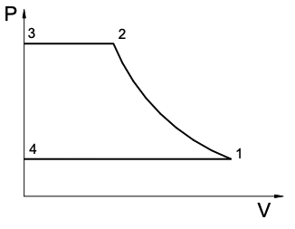

Si la presión del tanque es $p_T > p_2$, al llegar el gas a la presión $p_2$ (al llegar a la boca de salida) se pone bruscamente a la presión $p_T$ . La potencia consumida es mayor que si el compresor estuviera diseñado para una presión de salida $p_T$ , pues en este caso seguiría la curva politrópica hasta $p_T$ (ver Fig. 7.4).

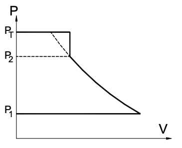

Si la presión del tanque es $p_T < p_2$, también la potencia consumida es mayor que si el
compresor estuviera geométricamente diseñado para una presión de salida $p_T$, pues el
diagrama del proceso ( ver fig. 7.5 ) no presentaría la punta hasta la presión $p_2$.

\newpage

# ANEXO

## un poco más de térmodinámica

### Primer principio de la Termodinámica
El primer principio de la Termodinámica expresa que **el calor** que se le entrega a un **sistema cerrado** se invierte totalmente en:
- aumentar su energía interna
- y en realizar trabajo exterior:
$$
\delta Q = dU + \delta W \ \ \ \ \ \ \ \ \ [J]
$$

o por **unidad de masa**
$$
\delta q = du + \delta w \ \ \ \ \ \ \ \ \ [J/kg]
$$

El trabajo realizado cuando el cuerpo pasa de un volumen $V_1$ a un
volumen $V_2$ vale:
$$
W = \int_{V_1}^{V_2} p \cdot dV
$$

### Calor específico.
Se define la propiedad termodinámica llamada **entalpía específica** (por unidad de masa, por eso las minúsculas) de un gas como:
$$
h = u + p \cdot v \ \ \ \ \ \ [J/kg] 
$$

Para un **gas ideal** $H = U + \frac{R \cdot T}{PM}$ y $U = f(T)$ entonces h o H son solo función de la temperatura.

Se definen dos calores específicos:
- a volumen constante $c_v$
- a presión constante $c_p$
$$
c_v = \left( \frac{\partial u}{\partial T} \right)_v \ \ \ \ \ \ \ \ c_p = \left( \frac{\partial h}{\partial T} \right)_p
$$
con
$$
c_p > c_v
$$
$$
c_p - c_v = \frac{R}{PM}
$$
además 
$$
\gamma = \frac{c_p}{c_v}
$$

#### Proceso adiabático

En este proceso **$\delta q = 0$** por lo que $\delta w = -du$ entonces $p \cdot dv = -c_v \cdot dT$.

Integrando desde el estado 1 al estadop 2:
$$
W = c_v \cdot (T_1 - T_2) \ \ \ \text{y como ya dijimos}\ \ \ Q = 0
$$

#### Proceso isotérmico

En este proceso **$\Delta T = 0$** entonces $du = 0$ por lo que $\delta w = \delta q$ además $\delta w = p \cdot dv$.

Integrando desde el estado 1 al estadop 2:
$$
W = - Q = \frac{R}{PM} \cdot T \ln{\left(\frac{p_1}{p_2}\right)}
$$

- en una compresión $W < 0 \ \ y\ \  Q > 0$
  
- en una expansión $W > 0\ \  y\ \  Q < 0$

#### Proceso politrópico
Es un proceso caracterizado por $p \cdot v^k = cte$.

Aplicando el primer principio $\delta q = du + \delta w$ queda
$\delta q = c_v \cdot dT - \frac{v}{k} \cdot dp$

Entonces
$$
W = \frac{p_2 \cdot V_2 - p_1 \cdot V_1}{1 - k}
$$
$$
Q = m \cdot \frac{k - \gamma}{k - 1} \cdot c_v \cdot (T_2 - T_1)
$$

#### Proceso isóbaro (presión constante).  ENFRIADOR
Este caso sirve muy bien para aproximar el calor transferido en un intercambiador de calor donde suponemos que dentro del mismo no hay pérdidas de carga del fluido a calentar o enfriar, o sea $p = cte$

entonces:

-  $W = 0$
  
-  $Q = m \cdot (h_2 - h_1) = m \cdot c_p \cdot (T_2 - T_1)$

